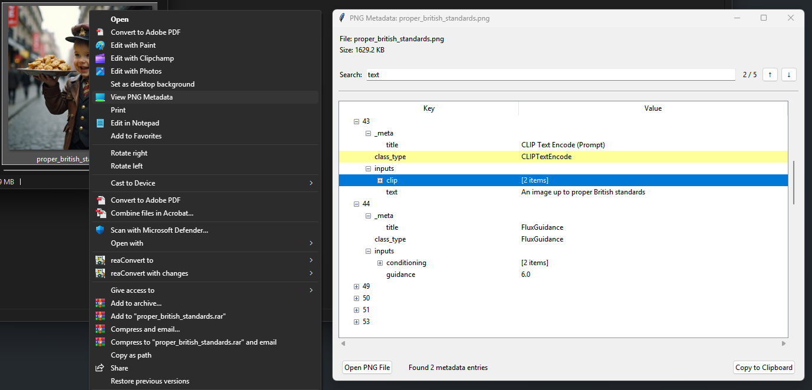

# Warning 
This project was designed and implemented by Claude 3.7.

# PNG Metadata Tools

A sophisticated system for managing metadata in PNG files with remarkable performance improvements over standard PIL methods.

## Simplified API

Our elegantly designed API provides up to 33x faster metadata operations than PIL, particularly for larger images:

```python
import png_metadata_tools as pmt

# Read metadata
metadata = pmt.read("path/to/image.png")

# Write metadata
pmt.write("path/to/image.png", {"rating": 1500, "tags": "landscape,mountain"})

# Update a single value
pmt.update("path/to/image.png", "rating", 1600)

# Check if a key exists
has_rating = pmt.has_key("path/to/image.png", "rating")

# Remove metadata
pmt.remove("path/to/image.png", "old_tag")

# Context manager for batch editing
with pmt.MetaEditor("path/to/image.png") as meta:
    meta["rating"] = 1500
    meta["processed"] = True
    meta["author"] = "British Standards"
```

## Batch Operations (Recommended)

For efficient processing of multiple files, our batch operations system truly shines:

```python
# Process multiple files with the same metadata
with pmt.BatchEditor(workers=4) as batch:
    # Update metadata for all PNG files in a directory
    for path in Path("my_images").glob("*.png"):
        batch.update(path, {
            "processed": "true",
            "batch_id": "batch_2025_02_25",
            "quality": "high"
        })
    
    # Using update_many for better efficiency
    all_images = list(Path("my_images").glob("*.png"))
    batch.update_many(all_images, {
        "processed_date": "2025-02-25"
    })
```

For advanced batch processing with filtering:

```python
from png_metadata_tools.batch_operations import (
    BatchProcessor, create_metadata_filter, create_update_operation
)

# Create a filter for images with specific metadata
filter_fn = create_metadata_filter(
    required_keys=["author"],
    value_conditions={
        "rating": lambda v: float(v) > 1500.0
    }
)

# Create an operation to apply
update_op = create_update_operation({
    "quality": "high",
    "processed": "true"
})

# Process all matching files
processor = BatchProcessor(workers=4)
results = processor.process(
    ["path/to/images/*.png"],  # File patterns
    lambda path: update_op,     # Operation factory
    filter_fn,                  # Filter function
    recursive=True              # Search subdirectories
)
```

## Metadata Backup System

Our ingenious backup system preserves metadata without copying entire images:

```python
from png_metadata_tools.metadata_backup import MetadataBackupManager

# Initialize backup manager
backup_mgr = MetadataBackupManager("path/to/backups")

# Create a versioned backup
backup_path = backup_mgr.create_versioned_backup("path/to/image.png", "v1.0")

# Create a daily backup
daily_backup = backup_mgr.create_daily_backup("path/to/image.png")

# Restore from backup
backup_mgr.restore_from_backup(backup_path, "path/to/restored.png")

# Batch backup multiple images
image_paths = list(Path("my_images").glob("*.png"))
results = backup_mgr.batch_backup(image_paths)
```

## PNG Metadata Viewer

Our package includes a splendid GUI viewer for inspecting PNG metadata on Windows 11:

```
# Run the installer script
python PNGMetadataViewer/install_viewer.py

# To uninstall
python PNGMetadataViewer/install_viewer.py --uninstall
```



This adds a "View PNG Metadata" option to your context menu for PNG files, providing a convenient interface for viewing metadata.

## Performance Benchmarks

Our benchmarks demonstrate remarkable performance improvements over PIL:

```bash
# Run benchmarks with the interactive script
python run_benchmark.py

# Or directly with command line arguments
python -m benchmarks.run --type performance --preset medium --output all
```

### Performance Results

The direct chunk manipulation approach provides significant advantages over PIL:
- Small images (0.25MP): 3.6x faster
- Medium images (4MP): 18.5x faster
- Large images (16MP+): 25-33x faster

The streaming implementation maintains excellent performance while significantly reducing memory usage for extremely large files.

### Memory Usage Characteristics

Our benchmark results reveal interesting memory usage patterns:

Both our standard and streaming handlers typically use more peak memory than PIL, but with notable differences in behavior:
- For small images (512x512): Both handlers use slightly more memory than PIL
- For medium images (2048x2048): Handlers use 2.8-3.4x more peak memory than PIL
- For large images (6144x6144): Handlers use 6.0-6.5x more peak memory than PIL

However, this increased memory usage is a deliberate trade-off for vastly improved processing speed. The memory increase is proportional to file size, making the approach viable for most modern systems. The streaming implementation still provides advantages in certain workflows where memory allocation patterns are particularly important.

Most crucially, while the streaming approach was initially designed for memory optimization, its true value emerges in workflow flexibility rather than reduced peak memory usage.

## Technical Details

### Core Components

- **Handler Factory**: Automatically selects the optimal implementation based on file size
- **Direct Chunk Handler**: High-performance implementation for typical use cases
- **Streaming Handler**: Memory-efficient implementation for extremely large files
- **Batch Processing**: Concurrent operations with proper thread safety
- **Metadata Queue**: Asynchronous processing with priority support
- **Backup System**: Version-controlled metadata backups

### Test Coverage

Our comprehensive test suite ensures reliability across all components:
- **Unit Tests**: Each component tested in isolation
- **Integration Tests**: Components tested working together
- **Performance Tests**: Comparison against PIL across various image sizes
- **Concurrency Tests**: Race conditions and thread safety verified
- **Edge Cases**: Handling of corrupted files, interruptions, etc.

## Installation

Clone the repository to access the full package including the PNG Metadata Viewer:

```bash
git clone https://github.com/vosreth/png-metadata-tools.git
cd png-metadata-tools
pip install -e .
```

### Requirements

The package requires the following dependencies:

```
colorama==0.4.6
coverage==7.6.12
iniconfig==2.0.0
memory-profiler==0.61.0
numpy==2.2.3
packaging==24.2
pillow==11.1.0
pluggy==1.5.0
psutil==7.0.0
pytest==8.3.4
pytest-cov==6.0.0
tkinterdnd2==0.4.2
```

*Delivering proper British standards for digital excellence since 2025*

